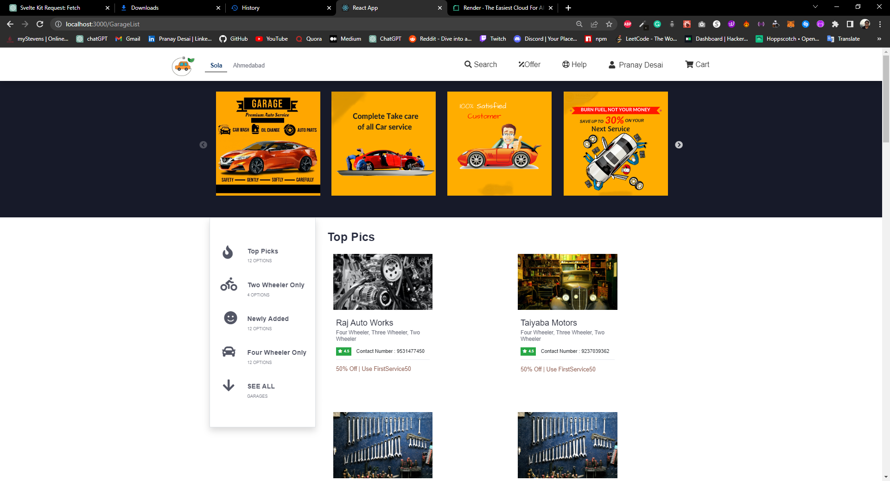
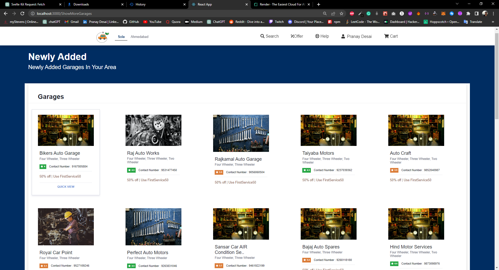
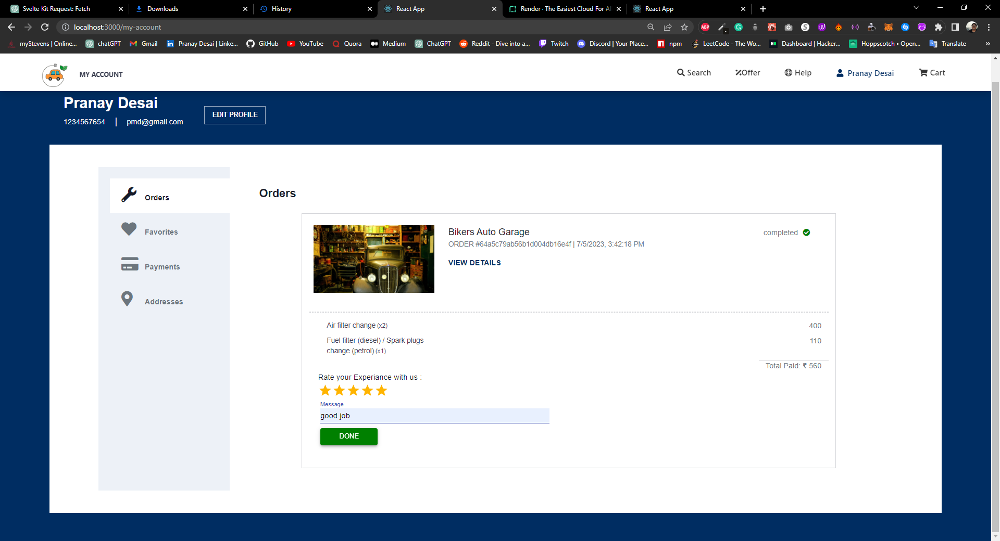

# OVS_front-end (Online Vehicle Services) https://ovs.pranaydesai.com
<h2>A Demo application, I made during my Bachelor's Degree Using MERN Stack</h2>

Which helps small garage owners to move their business online

and end-users to make service requests online.

<h1>❗ Important ❗</h1>

The back-end application is hosted on a free plan of render.com, So, it will be a little slow

This is just a demo application, use dummy data to log in or signUp, Don't use your original credentials which you use for other websites.

The Secure authentication features of both frontend and backend have been disabled.

This project is not maintained.

The portal for garage owners is not hosted anywhere.

<h1></h1>
<h2>🏠 Landing Page</h2>

<h2>👋 Login & SignUp</h2>

<h2>✉ Default OTP 9000</h2>

<h2> 👨‍🦱 My Account Page</h2>

<h2> 🛠 Garages in Your Area: Sorted with different categories</h2>

<h2> 🛠 Show more garages page</h2>

<h2> 🛠 Show more garages page</h2>

<h2>🔧 Single garage page</h2>

<h2>🛒 Add items to cart</h2>

<h2>✅ Checkout Page: Select or add address for service</h2>

<h2>🙂 Order Place: wait for Garage to accept your order</h2>

<h1>🧑‍🏭 Portal for garage owners to manage their upcoming orders</h1>

<h2>⏲ Order Accepted: Order in processing stage</h2>

<h2>⏲ Order Status update on user's account.</h2>

<h2>👍 After order completion Garage marks the order as Completed</h2>

<h2>⭐ After order Completion user can rate his/her experience </h2>

<h2>⭐ User's ratings for order reflects on garage owner's profile </h2>

